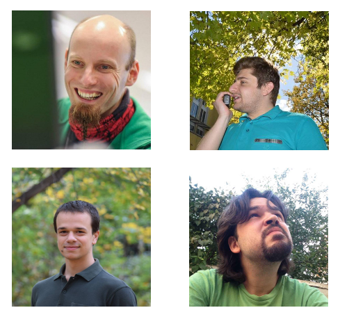
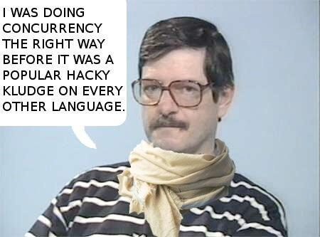

#HSLIDE
#### How We Created The University Course
### "Functional Programming With Elixir"

#HSLIDE

#HSLIDE
## Content

0. Introductions
1. Why we did what we did?!
2. What's our course about?
3. Future of our course...

#HSLIDE
### Who am I?

* Nikolay (Meddle)
* I am from Sofia  <!-- .element: class="fragment" -->
* I work in the public transport (Rails!) <!-- .element: class="fragment" -->
* I am part of elixir-lang.bg <!-- .element: class="fragment" -->

#HSLIDE

#HSLIDE
### Who am I?
* I am Not a native English speaker.
* Meet my teacher in English!

#HSLIDE

#HSLIDE
### Who are we?

* A group of people from FMI Sofia
* Big fans of Elixir/Erlang <!-- .element: class="fragment" -->
* And functional programming!!! <!-- .element: class="fragment" -->

#HSLIDE

#HSLIDE
### Who are you?

* You use/learn/work with Elixir!
* Or you want to use/learn/work with Elixir? <!-- .element: class="fragment" -->
* Or maybe Erlang?? <!-- .element: class="fragment" -->
* Or you are just HYPEd by these technologies? <!-- .element: class="fragment" -->

#HSLIDE

#HSLIDE
## Why we did what we did?!

#HSLIDE

#HSLIDE
### Why I did what I did?

* I am a Lambda...
* I saw Jose presenting Elixir once.  <!-- .element: class="fragment" -->
* That was it for me. I was hooked.  <!-- .element: class="fragment" -->
* I regret not knowing about Elixir/Erlang earlier.  <!-- .element: class="fragment" -->
* I wanted to do something meaningful with Elixir.  <!-- .element: class="fragment" -->

#HSLIDE
### About our surroundings

* We are from Bulgaria
* We are from FMI  <!-- .element: class="fragment" -->
* It is full of very smart people  <!-- .element: class="fragment" -->
* Every semester they can select from a set of elective courses  <!-- .element: class="fragment" -->

#HSLIDE
### Why we did what we did?

* Functional programming is important
* I know a professor teaching lambda calculus (that's Trifon) <!-- .element: class="fragment" -->
* He was IN right from the moment I told him about my idea for a course <!-- .element: class="fragment" -->
* So elixir-lang.bg was born <!-- .element: class="fragment" -->

#HSLIDE
### Why we did what we did?!

* Valo wanted to do Elixir pet project
* I had the idea - Elixir course <!-- .element: class="fragment" -->
* I met Andi & Slavi through Trifon <!-- .element: class="fragment" -->

#HSLIDE

#HSLIDE
## What's our course about?

#HSLIDE

#HSLIDE
### Rules of elixir-lang.bg

#HSLIDE
### Rules of elixir-lang.bg

* The course has to be free. <!-- .element: class="fragment" -->
* People outside FMI can attend it. <!-- .element: class="fragment" -->
* The course has to be in the evenings. <!-- .element: class="fragment" -->
* High grades should not be easy to earn. <!-- .element: class="fragment" -->
* The course should make students write code. <!-- .element: class="fragment" -->

#HSLIDE
### The first 'lecture'

#HSLIDE
### The first 'lecture'
* We made a presentation to advertise the course. <!-- .element: class="fragment" -->
* We made it clear that the course won't be easy. <!-- .element: class="fragment" -->
* It was once in a week for 3 hours (mistake). <!-- .element: class="fragment" -->

#HSLIDE
### The first half

* We talked about the functional Elixir. <!-- .element: class="fragment" -->
* No processes, no nodes, no meta. <!-- .element: class="fragment" -->
* Writing things like 'if', 'unless', 'cond' was forbidden. <!-- .element: class="fragment" -->
* We spent a big chunk of time on basic things. <!-- .element: class="fragment" -->
* The 'Functional' part of the name of the course was important. <!-- .element: class="fragment" -->

#HSLIDE

#HSLIDE
### The main idea

* We went very deep into implementation details. <!-- .element: class="fragment" -->
* It was important to show how things work. <!-- .element: class="fragment" -->
* We had homeworks - write code for points. <!-- .element: class="fragment" -->
* Up to 40 points from homeworks and up to 80 points from projects - your grade. <!-- .element: class="fragment" -->
* No tests, no paper-coding - only code. <!-- .element: class="fragment" -->

#HSLIDE
### The main idea

* Lectures were presentations. <!-- .element: class="fragment" -->
* Or live coding. <!-- .element: class="fragment" -->
* Or both. <!-- .element: class="fragment" -->
* We asked questions and gave bonuses. <!-- .element: class="fragment" -->
* We had the blog - it was really a book. <!-- .element: class="fragment" -->

#HSLIDE

#HSLIDE
### The second half

* Processes, processes, processes, OTP! <!-- .element: class="fragment" -->
* Started with the history of Erlang as told by Joe Armstrong! <!-- .element: class="fragment" -->
* OTP in great detail - implemented our own GenServer logic.  <!-- .element: class="fragment" -->

#HSLIDE

#HSLIDE
### The second half

* META to the end. <!-- .element: class="fragment" -->
* Live meta programming. <!-- .element: class="fragment" -->
* Quoting and quoting and unquoting. <!-- .element: class="fragment" -->

#HSLIDE

#HSLIDE
### The second half

* As a whole more live coding <!-- .element: class="fragment" -->
* Had guest lecturer, the founder of the Elixir Sofia meetup - Ventsi <!-- .element: class="fragment" -->
* Hacked with plug. <!-- .element: class="fragment" -->
* Looked into inter-node communication. <!-- .element: class="fragment" -->

#HSLIDE

#HSLIDE
### The exam

* Great projects <!-- .element: class="fragment" -->
* Tired people <!-- .element: class="fragment" -->
* People in love with Elixir <!-- .element: class="fragment" -->
* Not even half of them passed... <!-- .element: class="fragment" -->

#HSLIDE

#HSLIDE
### The after-party

#HSLIDE
### The mistakes

* Too long lectures - 3 hours!
* Too much time spent before going into processes.
* The schedule was a bit weak - made while watching Mortal Kombat and Rocket League on Twitch.
* Chaos...

#HSLIDE

#HSLIDE
## Future of our course

#HSLIDE
### Future of our course
* We will be back
* Two times a week, shorter lectures <!-- .element: class="fragment" -->
* More guest lecturers <!-- .element: class="fragment" -->
* More teachers  <!-- .element: class="fragment" -->
* More advanced topics <!-- .element: class="fragment" -->

#HSLIDE

#HSLIDE
## Thank you!

